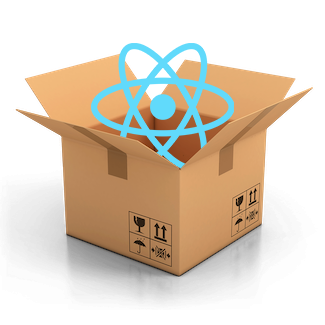

# Create React Parcel

This is a simple Parcel React JS boilerplate project for anyone to use. ;)

**Quick Setup**

> Run npx and give your amazing new project a name

    npx @hasala2002/create-react-parcel my-amazing-project

> Then move into your newly created amazing project.

    cd my-amazing-project

> Run npm start to run your project on http://localhost:1234 Happy Hacking!
    
    npm start

**Build** 

> Run npm build to create a parcel build of your amazing project.

    npm  build

